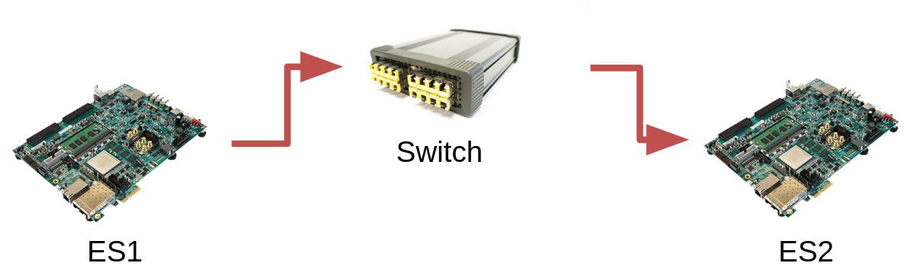

# Error Detection and Correction Algorithms in Python in Avionics Contexts

In this repository, we have the implementation from scratch of some error detection and correction algorithms used in avionics and computer networks.

## Installation

If you don't have Python installed in your computer, follow the steps related to your operating system (OS).

### Ubuntu and MacOS

To install Python and Python's Virtual Environment on Ubuntu, run the following commands on terminal:
```bash
$ sudo apt-get update
$ sudo apt-get install python3 python3-venv
```

On the other hand, to install it on MacOS, run:
```bash
$ brew install python3
```

This implementation has no dependecies, but it is better if you create a virtual environment to execute it.

Create a virtual environment.
```bash
python3 -m venv venv --prompt="error-detection"
```

After that, we will have a venv folder in the directory. Activate the virtual environment.
```bash
source venv/bin/activate
```

Now you have the virtual environment activated.

### Windows
To install Pyton on Windows, you have to download the its installer. Go to the [Python's website](https://www.python.org/downloads/windows/) and choose the proper installer. 

Run the installer, and REMEMBER TO SET THE ADD PYTHON TO PATH OPTION.


After the installation, open your CMD, enter in the project directory, and create a virtual environment to run this project.

To create a virtual environment, run this command on Windows CMD.
```cmd
python3 -m venv venv --prompt="error-detection"
```

After that, we will have a venv folder in the directory. Then, run:
```cmd
C:\Users\Guy\Download\error_detection> .\venv\Scripts\bin\activate.bat 
```

Now, you have the virtual environment activated.

## Usage



The goal is to connect and communicate two End-Systems (ES) with the help of a Switch.

The switch should be executed first, then, the ESs can be started. Thus, you need to open three terminal windows, all terminal windows must have the virtual environment activated. 

To execute the switch you can simply call the [switch.py](switch.py) with or without the `redundancy` and `error` as arguments.
```bash
(error-detection) $ python switch.py
```
or
```bash
(error-detection) $ python switch.py --redundancy 2 -error 1
```
The `redundancy` argument indicates the number of switches to initialize, creating a redundancy in the communication. The `error` argument indicates the switch index to inject error into.

To execute the ES you have to pass the name of the `algorithm` and the switches `ports` as arguments when running the [es.py](es.py).
```bash
(error-detection) $ python es.py --algorithm crc -ports 12345
```
The `algorithm` options are: parity, crc, and hamming. The `ports` arguments accepts the ports of the switches to tell the ES to connect to.


## File Description

```bash
├── README.md # this file
├── img # folder that contains the image used in the README.md
├── algorithms # folder that contains the algorithm implementations
│   ├── crc.py # Cyclic Redundancy Check implementation
│   ├── hamming.py # Hamming Code implementation
│   └── parity.py # Odd Parity Error Detection implementation
├── switch.py # Simulating the switch, which transfer the messages between the ESs.
└── es.py # Simulating a End-System, sends messages to other End-Systems through the switch.
```